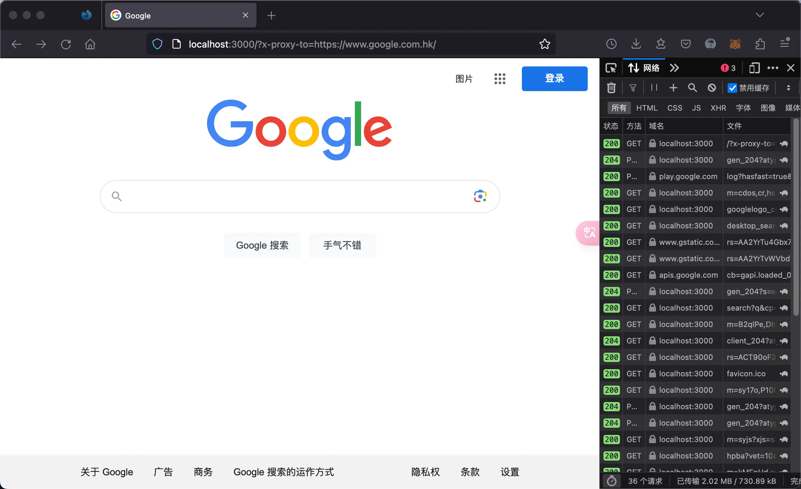

# X-Proxy: Dynamic Reverse Proxy Made Simple

Easily create a dynamic reverse proxy for any endpoint with just a simple URL prefix addition.



## ⚡️ Quick Setup

[](https://hub.docker.com/r/idootop/x-proxy)

Launch the X-Proxy service on port 3000 using Docker:

```shell
docker run -d -p 3000:80 idootop/x-proxy:1.0.0
```

To start proxying, modify your desired endpoint's address to:

```shell
http://localhost:3000/?x-proxy-to=`target-endpoint`
```

Example:

```shell
http://localhost:3000/?x-proxy-to=https://www.google.com
```

That's all you need. Now you can proxy with ease!

## 👨‍💻 The Why

For developers working under specific network restrictions, accessing essential third-party services like [openai.com](https://openai.com/), [github.com](https://github.com), [npmjs.com](https://www.npmjs.com/) can be a hassle due to well-known constraints in certain regions, like mainland China.

A common workaround is to access these services from supported regions and proxy the responses back. While there are many proxy services out there tailored to individual sites, imagine having a versatile proxy that dynamically works with any URL without altering the request's headers or body, simply by changing the base URL.

X-Proxy fulfills this scenario. It's not perfect, but it achieves this goal and meets expectations satisfactorily.

Enjoy!

## 🚨 DISCLAIMER

> Please be aware that using X-Proxy may change the original request data like IP, host, and other headers, and omits certain security headers from the proxy's responses. It also implements `Access-Control-Allow-Origin: '*'` headers to facilitate CORS support. Use with awareness and acknowledge the associated risks.

By using this software, you take full responsibility for its application and any resulting consequences. The repository is meant purely for educational purposes and must not be exploited for commercial uses or in violation of laws and regulations. Exercise caution and be fully aware of the risks when using this software.
